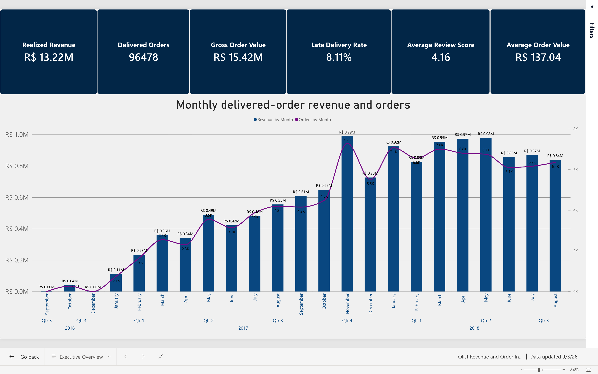
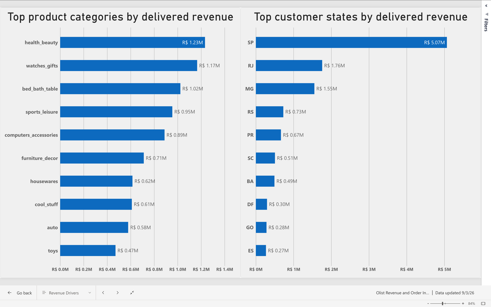
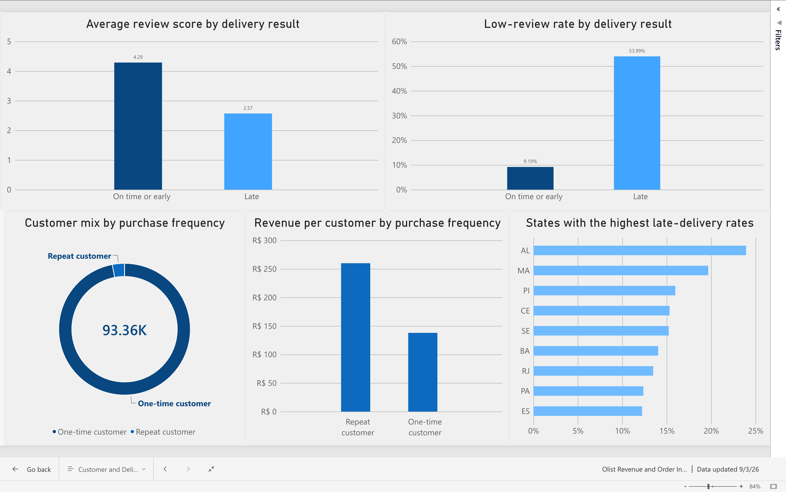

# E-Commerce Revenue and Order Intelligence

A PostgreSQL-first analytics portfolio project using the real Olist Brazilian e-commerce dataset, with a completed three-page Power BI report. The project combines relational modeling, analytical SQL, data reconciliation, and visual reporting to explain marketplace revenue, customer behavior, and delivery quality.

**At a glance:** 96,478 delivered orders · R$13.22 million in delivered merchandise value · 93,358 purchasing customers.

[View the report screenshots](#power-bi-report) · [Explore the SQL](sql/02_analysis.sql) · [Read the validation results](documentation/VALIDATION_REPORT.md)

## Project objective

A multi-seller marketplace needs a reliable reporting layer that answers questions such as:

- How much merchandise revenue was realized?
- How are orders and revenue changing over time?
- Which products and categories generate the most revenue?
- How concentrated is revenue across products?
- Which customers have the highest lifetime value?
- How frequently do customers make repeat purchases?
- Which states experience the highest delivery-delay rates?
- How are delivery delays associated with customer reviews?
- Do payment totals reconcile with merchandise and freight values?

## Dataset

**Source:** [Olist Brazilian E-Commerce Public Dataset](https://www.kaggle.com/datasets/olistbr/brazilian-ecommerce)

The dataset contains anonymized marketplace transactions from Brazil, including:

- 99,441 orders
- 112,650 order-item records
- 99,441 customer records
- 32,951 products
- 103,886 payment records
- 99,224 review records
- 3,095 sellers
- More than one million geolocation observations

Purchase records cover September 2016 through October 2018. The delivered-order revenue extract covers purchase months September 2016 through August 2018.

Raw CSV files are intentionally excluded from Git and must be downloaded separately from Kaggle.

## Tools and techniques

- PostgreSQL 18
- Relational schema design
- Primary and foreign keys
- Composite keys
- Joins and conditional aggregation
- Common table expressions
- `LAG`
- `RANK`
- `ROW_NUMBER`
- Running-window calculations
- Calendar generation with `GENERATE_SERIES`
- Data-quality and reconciliation SQL
- Git and GitHub
- Power BI Service (web): semantic model, DAX measures, report visuals and tooltips

## Power BI report

The report uses six compact PostgreSQL-derived CSV extracts. The screenshots below are included so the project can be reviewed without Power BI access.

### Executive Overview

Six KPI cards summarize delivered orders, merchandise revenue, gross order value, late-delivery rate, review score, and average order value. The monthly combination chart uses the left axis for BRL revenue and the right axis for order counts.



### Revenue Drivers

Top-ten category and customer-state revenue rankings identify where delivered merchandise value is concentrated. Category order counts are not additive: an order can contain products from more than one category.



### Customer and Delivery Quality

Customer mix and revenue per customer are shown alongside review outcomes by delivery timing and a state late-delivery ranking. The customer mix comprises 90,557 one-time customers and 2,801 repeat customers; the donut's center shows the total of 93,358 customers.



See the [Power BI reporting guide](powerbi/README.md) for table grains, measure rules, refresh limitations, and the [reference DAX measures](powerbi/MEASURES.md). The live report remains in the author's Power BI workspace; this repository does not grant access or contain a public embed link or a PBIX file.

## Repository structure

```text
olist-ecommerce-intelligence/
├── README.md
├── .gitignore
├── data/
│   └── raw/                         # Local source CSVs; excluded from Git
├── documentation/
│   ├── DATA_DICTIONARY.md
│   ├── ERD.md
│   ├── METRIC_DEFINITIONS.md
│   ├── PORTFOLIO_SUMMARY.md
│   └── VALIDATION_REPORT.md
├── powerbi/                         # Power BI Web reporting layer and extracts
│   ├── README.md
│   ├── MEASURES.md
│   └── data/                         # Generated reporting CSVs
├── screenshots/
│   ├── 01_executive_overview.png
│   ├── 02_revenue_drivers.png
│   └── 03_customer_delivery_quality.png
├── scripts/
│   ├── export_powerbi_data.sh
│   └── load_data.sh
└── sql/
    ├── 01_schema.sql
    ├── 02_analysis.sql
    └── 03_validation.sql
```

## Data model

The transactional model connects:

```text
customers → orders → order_items → products
                         ↓
                       sellers

orders → payments
orders → reviews
```

`customer_unique_id` is used for shopper-level analysis because `customer_id` represents the customer record associated with an individual order.

Order items, payments, and reviews are each aggregated before being combined. This prevents one-to-many joins from multiplying rows and inflating revenue.

See the complete [entity relationship diagram](documentation/ERD.md) and [data dictionary](documentation/DATA_DICTIONARY.md).

The PostgreSQL relational model is separate from the Power BI reporting model. The six Power BI tables have different aggregate grains and are kept independent; a filter on one does not automatically filter the others.

## Metric definitions

Unless explicitly stated otherwise:

- Delivered orders include `order_status = 'delivered'`.
- Realized revenue equals delivered `order_items.price`.
- Revenue excludes freight.
- Gross order value equals item price plus freight.
- Average order value equals delivered merchandise revenue divided by delivered orders.
- Late delivery means the customer delivery timestamp is later than the estimated delivery timestamp.
- Multiple review records are averaged within each order. A low review means this order-level mean is at most 2; each reviewed order then has equal weight in the group metrics.

See [METRIC_DEFINITIONS.md](documentation/METRIC_DEFINITIONS.md) for the complete measurement rules.

## Key findings

### Marketplace performance

- 96,478 orders were delivered, representing 97.02% of all orders.
- Delivered merchandise revenue totaled **R$13,221,498.11**.
- Average delivered-order value was **R$137.04**.
- Delivered freight value totaled **R$2,198,275.64**.
- Delivered gross order value was **R$15,419,773.75**.

### Product performance

- Health and Beauty was the highest-revenue category at **R$1,233,131.72**.
- Watches and Gifts ranked second at **R$1,166,176.98**.
- The highest-revenue individual product generated **R$63,560.00**.
- The top product contributed only 0.481% of revenue.
- The top 20 products contributed 5.449% of revenue, demonstrating a long-tail product catalog.

### Customer behavior

- 90,557 customers made one delivered purchase.
- 2,801 customers were repeat customers.
- Repeat customers represented only 3.00% of purchasing customers.
- Repeat customers generated an average of **R$260.05** per customer, compared with **R$137.96** for one-time customers.

### Delivery and review quality

- Late delivered orders had an average review score of **2.57**.
- On-time or early orders had an average review score of **4.29**.
- The low-review rate was 53.99% for late deliveries and 9.19% for on-time or early deliveries.
- Alagoas had the highest qualified late-delivery rate at 23.93% in SQL Q10, which requires at least 100 delivered orders with both delivery timestamps available per state.

The delivery and review results show an association, not proof that delivery delays caused lower reviews.

## Data validation

The validation suite confirmed:

- All nine database table counts match the source CSV files.
- All tested primary and composite keys contain zero duplicates.
- All tested foreign-key relationships contain zero orphan records.
- The order-level reporting model contains zero multiplied rows.
- Delivered revenue reconciles exactly across independent calculations.
- No negative prices, negative freight values, or invalid review scores exist.

Payment value exceeds item-plus-freight value by 1.04% across all statuses. Approximately 98.4% of this net variance comes from orders that have payment records but no item rows, primarily unavailable or canceled orders.

See the complete [validation report](documentation/VALIDATION_REPORT.md).

## Reproducing the project

### 1. Prerequisites

Use PostgreSQL 18 and a compatible `psql` client. The schema dump records PostgreSQL 18.6 (Postgres.app); it contains version-specific settings and `psql` commands. This project was developed on macOS.

Start the local PostgreSQL server on port 5432 before running the database commands. Put the PostgreSQL binaries on your PATH. For Postgres.app on macOS:

```bash
export PATH="/Applications/Postgres.app/Contents/Versions/latest/bin:$PATH"
```

Run the following commands from the repository root. The loader and exporter default to the Postgres.app `psql` path; on other systems, set `PSQL_BIN` to the full path of your installed `psql` binary. Both scripts accept `DB_NAME`; the loader also accepts `RAW_DIR`. They use localhost and port 5432.

### 2. Download the data

Download the Olist dataset from Kaggle and place the nine CSV files inside:

```text
data/raw/
```

### 3. Create the database

```bash
createdb -h localhost -p 5432 olist_revenue_intelligence
```

If PostgreSQL is not on your system path, use the full path to `createdb`.

### 4. Create the database structure

Run this once against an empty database. The schema script is not a reset or migration script; do not rerun it against a populated project database.

```bash
psql \
  -X -v ON_ERROR_STOP=1 \
  -h localhost \
  -p 5432 \
  -d olist_revenue_intelligence \
  -f sql/01_schema.sql
```

### 5. Load the CSV files

```bash
chmod +x scripts/load_data.sh
./scripts/load_data.sh
```

The loader validates that all required files exist and refuses to load data when the orders table is already populated.

### 6. Run the analysis

```bash
psql \
  -X -v ON_ERROR_STOP=1 \
  -h localhost \
  -p 5432 \
  -d olist_revenue_intelligence \
  -P pager=off \
  -f sql/02_analysis.sql
```

### 7. Run validation

```bash
psql \
  -X -v ON_ERROR_STOP=1 \
  -h localhost \
  -p 5432 \
  -d olist_revenue_intelligence \
  -P pager=off \
  -f sql/03_validation.sql
```

### 8. Export the Power BI reporting data

```bash
chmod +x scripts/export_powerbi_data.sh
./scripts/export_powerbi_data.sh
```

The export script writes six compact, dashboard-ready CSV files to
`powerbi/data/`. These extracts preserve the metric definitions used by the
validated SQL analysis and are the source layer for the Power BI Web report.

See [powerbi/README.md](powerbi/README.md) for the reporting-table grains and
completed report structure. Re-exporting these local CSVs does not automatically refresh the Power BI Service model; its sources must be updated separately.

## Analytical limitations

- The dataset does not provide a verified returns or refunds field.
- Delivery delay and review score are used as operational-quality indicators, not return-rate measures.
- Review analysis only represents orders with submitted reviews.
- Written review titles and messages are optional and highly sparse.
- Eight delivered orders lack delivery timestamps and are excluded from delay-rate denominators.
- The data is historical and must not be described as current Olist performance.
- Transaction value is not equivalent to accounting revenue, net revenue, margin, or profit.
- Customer lifetime revenue and repeat-purchase behavior refer only to the observed dataset window, not a customer's complete lifetime or a cohort retention rate.
- The monthly CSV includes only months with delivered revenue; November 2016 is absent. SQL Q5 separately uses a calendar series for zero-month-aware growth calculations. Do not treat adjacent CSV rows as necessarily consecutive months.
- Power BI group rates and review averages must not be summed or averaged into overall KPIs; use the project-level KPI extract or recompute from the correct raw denominators.

## Project status

Complete locally: PostgreSQL schema, data loader, ten analysis queries, validation SQL, ERD, metric definitions, data dictionary, reporting exporter, six reporting extracts, and a three-page Power BI report with saved screenshots.

GitHub and portfolio-website publication are separate handoff steps. A concise project description and publication checklist are available in [PORTFOLIO_SUMMARY.md](documentation/PORTFOLIO_SUMMARY.md).
