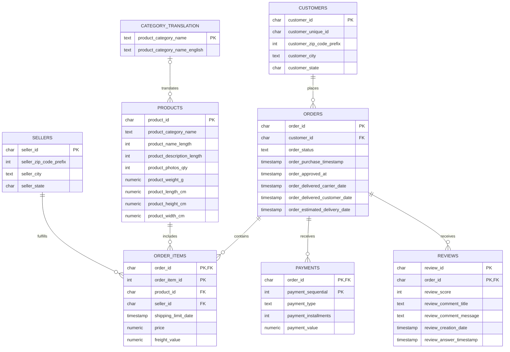

# Olist E-Commerce Database ERD

This entity relationship diagram represents the PostgreSQL data model used for the Olist revenue and order intelligence analysis.

## Modeling notes

- `customer_id` identifies the customer record attached to one order.
- `customer_unique_id` identifies the same shopper across multiple orders and should be used for lifetime-customer analysis.
- `order_items`, `payments`, and `reviews` are one-to-many children of `orders`.
- `order_items` uses the composite primary key `(order_id, order_item_id)`.
- `payments` uses `(order_id, payment_sequential)`.
- `reviews` uses `(review_id, order_id)` because `review_id` is not globally unique in the source.
- Product categories are connected to the translation table logically rather than through an enforced foreign key because two source categories lack English translations.
- `geolocation` is excluded from the transactional ERD because ZIP prefixes repeat. It contains multiple coordinate observations per ZIP prefix and does not have a safe direct one-to-one relationship with customers or sellers.

## Power BI model boundary

This ERD describes PostgreSQL, not the Power BI model. The reporting exporter creates six pre-aggregated CSV tables for the three-page report. They are kept independent because their grains differ and they do not supply shared row-level relationship keys. See the [reporting guide](../powerbi/README.md) for the snapshot and filter limitations.
